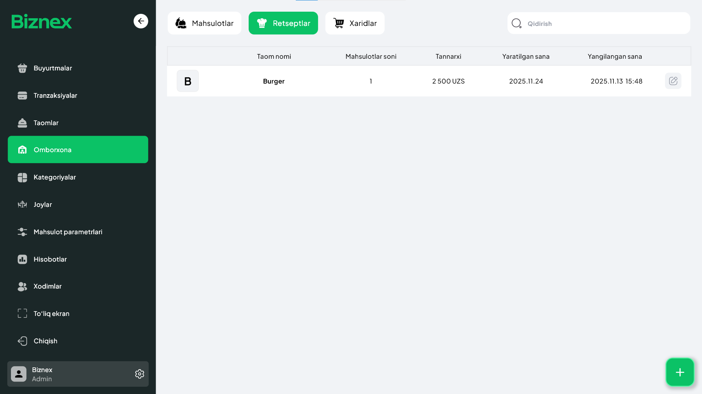

## Retseptlar 🧾🍽️
**Retsept** — bu har bir *taom / mahsulot / salat*ni mijozga berilgunga qadar unga **qaysi masalliqlar** kerak bo‘lishi, **qancha miqdorda** sarflanishi va **tannarxi** qancha bo‘lishini aniq hisoblash tizimi.

Retseptlar quyidagi savollarga javob beradi:  
- 🥦 Qaysi masalliqlar kerak?  
- ⚖️ Har bir masalliqdan qancha ketadi?  
- 💰 Taomning tannarxi qancha bo‘ladi?  
- 📉 Ombor (stock)dan masalliqlar qanday kamayadi?  

## Retsept yaratish jarayoni 🍲

### 1. Retseptlar bo‘limiga o‘tish
**Omborxona → Retseptlar** bo‘limiga kiring.

### 2. Taom/Mahsulot/Salat tanlash
Yangi retsept qo‘shish uchun ro‘yxatdan kerakli **taom**, **mahsulot**, yoki **salat**ni tanlang.  
Masalan: *Osh*, *Pitsa*, *Grecheskiy salat*.

### 3. Masalliqlarni kiritish
Tanlangan taom uchun kerak bo‘ladigan **masalliqlar ro‘yxatini** to‘ldiring:  
- Masalliq nomi  
- Miqdor (kg, dona, litr…)  
- Qancha sarflanishi  

### Misol:
**1 kg Osh** tayyorlash uchun:  
- 0.4 kg — guruch  
- 0.4 kg — sabzi  
- 0.4 kg — go‘sht  
- 0.1 kg — yog‘  
- 0.05 kg — piyoz  

### Natija qanday ishlaydi?
Siz retseptni yaratganingizdan so‘ng:  
- Har safar *Osh* sotilganda, tizim **retsept bo‘yicha masalliqlarni** avtomatik ombor zaxirasidan ayirib boradi.  
- Tannarx aniq hisoblanadi  
- Ombor hisobi to‘g‘ri yuritiladi  
- Hisobotlar va statistika xatolarsiz bo‘ladi  

## Nechun retsept muhim? 🎯
- 📉 Masalliqlar sarfini nazorat qiladi  
- 💸 Tannarxni aniq ko‘rsatadi  
- 🚫 Yo‘qotishlar va o‘g‘irlikning oldini oladi  
- 📊 Hisobotlar va statistikalar **aniq va to‘g‘ri** bo‘ladi  
- 🧑‍🍳 Oshpazlar uchun standart retsept saqlanadi  

