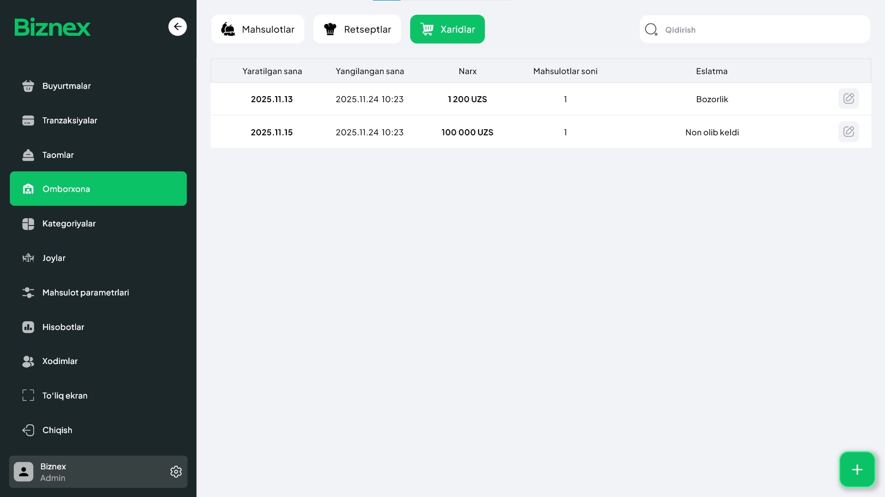

## Xaridlar 🧾🛒
**Xarid** — bu siz bozor yoki yetkazib beruvchilardan olgan masalliqlar (yoki mahsulotlar) partiyasidir. Sodda qilib aytganda — bu **bozorlik qilish jarayoni**: nima olindi, qancha olindi va qancha narxga olindi.

## Xarid qo'shish — qisqacha qadamlar ➕
**Omborxona → Xaridlar → +** tugmasi orqali yangi xarid kiriting.  
Xarid qo‘shishda quyidagilarni kiriting:  
- 🏷️ Mahsulot nomi (masalan: Sabzi)  
- ⚖️ Miqdori (masalan: 200 kg)  
- 💰 Birlik narxi (masalan: 5 000 so'm)  
- 🧾 Yetkazib beruvchi (optional, ammo tavsiya etiladi)  
- 📅 Xarid sanasi  
- 🔢 Invoice/Receipt raqami (agar mavjud bo‘lsa)  
- 🧾 To‘lov turi (naqd, karta, hisob-kitob)  

### Misol:
- Sabzi — **200 kg**, **5 000 so'm/kg**  
- Guruch — **100 kg**, **12 000 so'm/kg**

Xarid qo‘shilgach, tizim avtomatik ravishda omborda mahsulot miqdorini yangilaydi.

---

## Nima uchun xaridlarni tizimga kiritish muhim? 🎯
1. 📦 **Ombor hisoboti to‘g‘ri bo‘ladi** — qancha mahsulot bor/yo‘qligini real vaqtda bilasiz.  
2. 💸 **Xarajatlar nazorati** — xarid narxlari saqlansa, tannarx va foyda aniq chiqadi.  
3. 📊 **Hisobotlar aniq bo‘ladi** — xarid ma’lumotlari asosida xaridlar bo‘yicha tahlil, sotib olishlar bo‘yicha xarajatlar va COGS (cost of goods sold) hisobi olinadi.  
4. 🤝 **Yetkazib beruvchilarni boshqarish** — kimdan qancha olganingiz, kim yetkazib bermay qolayotganini kuzatish oson.  
5. 🧾 **Audit va soliq uchun hujjatlar** — invoice va kvitansiyalar bilan soliq va auditing jarayonlari soddalashadi.  
6. ⏳ **Yaroqlilik va partiya kuzatuvi** (agar kerak bo‘lsa) — mahsulotning batch/lot va expiry sanasini saqlash orqali yo‘qotishlarni kamaytirish.

---

## Xaridlar uchun tavsiya etiladigan qo‘shimcha maydonlar
- Supplier / Yetkazib beruvchi nomi  
- Invoice raqami yoki PDF ilova qilish (agar mavjud bo‘lsa)  
- Batch/Lot raqami va expiry sanasi (perishable goods uchun)  
- Omborga joylashuv (qaysi saqlash joyi)  
- Qo‘shimcha eslatmalar (masalan: yetkazib berishda qadoqlash muammosi)

---

## Hisobotlar va statistika 📈
Xaridlar moduli quyidagi hisobotlarni taqdim etishi kerak:  
- 🧾 **Xaridlar bo‘yicha umumiy hisobot** — davr, yetkazib beruvchi, mahsulot bo‘yicha jami miqdor va qiymat.  
- 🤝 **Yetkazib beruvchi bo‘yicha hisobot** — har bir supplier dan olingan summa va mahsulotlar.  
- 📉 **Narx o‘zgarishi hisobotlari** — vaqt davomida mahsulot narxlarining o‘zgarishi.  
- 🧾 **Invoice reconcilliation** — to‘lovlar va invoice moslashuvi.  
- 🧾 **Inventory valuation** — ombordagi mahsulotlarning joriy qiymati (average cost yoki FIFO/LIFO usuliga ko‘ra, agar qo‘llab-quvvatlansa).  
- ⌛ **Expiry/Batch report** — muddatidan oldin ishlatilishi yoki sotilishi kerak bo‘lgan mahsulotlar.  
- 🧾 **COGS va profit analiz** — xaridlar, retseptlar va sotuvlar asosida tannarx va foyda hisoboti.

---

## Yaxshi amaliyotlar (best practices) ✅
- 🕒 **Xaridni darrov kiriting** — bozor qaytib kelganda yoki yetkazib bergach, darhol tizimga yozing.  
- 🧾 **Invoice va kvitansiyalarni ilova qiling** — keyinchalik soliq yoki audit uchun qulay bo‘ladi.  
- ⚖️ **Birliklarni standartlashtiring** (kg, litr, dona, portsiya) — unit conversion muammolarini kamaytiradi.  
- 🔄 **Narxlarni yangilab boring** — bozor narxlari o‘zgaradi, narxlarni kundalik/haftalik tekshirish hisob-kitoblarni to‘g‘ri qiladi.  
- 🏷️ **Batch va expiry ni qayd eting** — kanalizatsiya va yo‘qotishlarni kamaytiradi.  
- 📊 **Yetkazib beruvchilarni baholang** — yetkazib berish tezligi, sifat va narx bo‘yicha reyting tuzing.  
- 🔔 **Reorder point qo‘ying** — minimal miqdorga yetganda ogohlantirish va avtomatik xarid takliflari.

---

## Qisqacha yakun ✨
Xaridlar bo‘limiga to‘g‘ri va tartibli ma’lumot kiritish — bu omborni boshqarish, tannarxni aniqlash va aniq hisobotlar olishning asosi. Har bir xaridni batafsil va tez kiritish orqali siz biznesni yaxshi nazorat qilasiz va yo‘qotishlarni kamaytirasiz.

