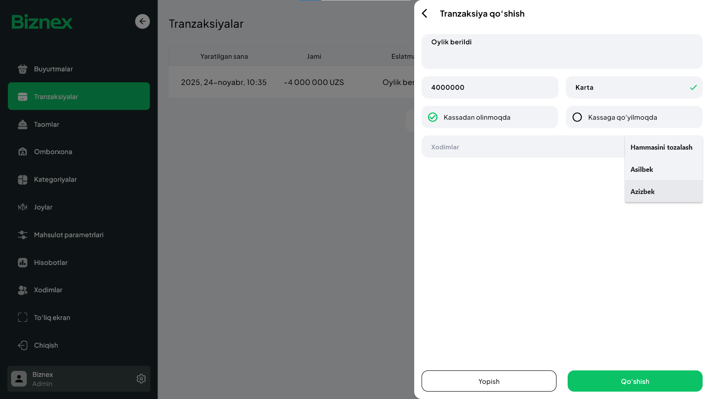

# **Tranzaksiyalar 💰📊**

Tranzaksiya — biznesingiz hisobiga **tushadigan** yoki hisobingizdan **chiqadigan** pul harakati.  
Qisqa qilib aytganda, biznesdagi **aylanma mablag‘lar** oqimi.

Masalan:

- ⏰ 08:13 da **170 000 UZS** buyurtma bo‘ldi → 1 ta tranzaksiya  
- ⏰ 08:37 da **90 000 UZS** ga non sotib oldingiz → 1 ta tranzaksiya  
- ⏰ 11:03 da **2 000 000 UZS** xarid qilindi → 1 ta tranzaksiya  
- 📅 24-noyabr **30 000 UZS** elektr uchun to‘landi → 1 ta tranzaksiya  

## **Tranzaksiya qo‘shish ➕**

**Tranzaksiyalar** bo‘limiga kirasiz → **+**  

Tranzaksiya qo‘shish uchun quyidagilarni kiritasiz:

- 📝 **Tranzaksiya uchun eslatma**  
  Masalan: *“Non uchun to‘lov”*, *“Buyurtma #124”*, *“Xodimga avans”*  

- 💵 **Summasi**  
  Qancha pul tushdi yoki chiqdi.

- 🔄 **Kassadan olinmoqda / Kassaga qo‘yilmoqda**  
  Pulning yo‘nalishi: kirim yoki chiqim.

- 💳 **To‘lov turi**  
  - Naqd 💵  
  - Click 💻  
  - Payme 📱  
  - Uzum 🟣  
  - Karta 💳  

- 👤 **Kimga**  
  Agar xodim bilan bog‘liq bo‘lsa — xodimni tanlaysiz.

---

## **Tranzaksiyalar nima uchun kerak? 🎯**

**1. Pul oqimini nazorat qilish 🧾**  
Har bir kirim-chiqim aniq qayd etiladi. Pul yo‘qolmaydi, chalkashlik bo‘lmaydi.

**2. Haqiqiy biznes holatini ko‘rish 📈**  
Qancha tushum bo‘ldi, qancha chiqim bo‘ldi — kunlik, haftalik, oylik tahlillar ko‘rinadi.

**3. Kassa balansining to‘g‘riligini ta’minlaydi ⚖️**  
"Kassadan pul oshyapti", "kam chiqyapti" degan muammolar bartaraf bo‘ladi.

**4. Hisobotlar shakllanishi 🧾**  
Tranzaksiyalar asosida quyidagi tahlillar tayyorlanadi:
- 💵 Tushumlar  
- 💸 Chiqimlar  
- 🏦 To‘lov turlariga ko‘ra aylanma  
- 👥 Xodimlar bilan bog‘liq pul harakati  
- 📊 Xarajat tahlillari  

**5. Mayda-chuydadan tortib katta xarajatlargacha hammasi tartibga tushadi 🏷️**  
5 000 so‘mlik choydan boshlab, millionlab so‘mlik xaridlargacha — barcha harakatlar tizimga tushadi.

---

🎉 Shu bilan siz **Tranzaksiyalar** bo‘limi orqali biznesingizning pul oqimini to‘liq nazorat qilishingiz mumkin!
