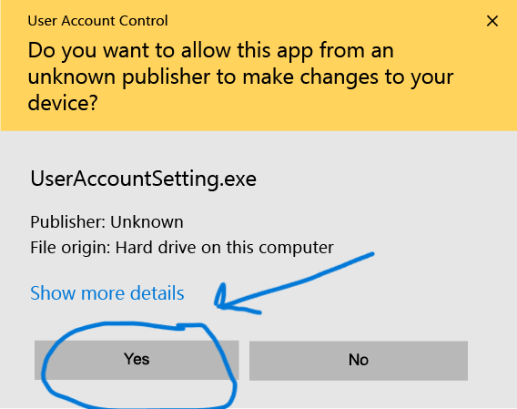

## 1. Biznex ilovalari haqida
**Biznex** tizimi ikki qismdan iborat:  

- **Biznex POS** – restoran, kafe va choyxonalar uchun.  
- **Biznex Fastfood** – fastfood markazlari uchun.  

Ikki xil bo‘lishining sababi – jarayonlarda farq mavjud.  
- Fastfood’da buyurtma tez yaratiladi va mijozga **navbat cheki** beriladi.  
- Restoran/kafe’da esa buyurtma jarayoni boshqa tartibda yuradi.  

(Bundan keyingi o‘rinlarda ikkala tizim ham **“Biznex ilovasi”** deb yuritiladi.)  

## 2. Yuklab olish
Ilovani o‘z biznesingiz turiga qarab yuklab oling:  

- [**Biznex POS yuklab olish**](#) 👈
- [**Biznex Fastfood yuklab olish**](#) 👈 

⚠️ Hozirda faqat **Windows OS** uchun mavjud.  

## 3. O‘rnatish jarayoni
1. Yuklab olingan faylni ishga tushiring.  
2. Ba’zida kompyuteringiz uni **virus sifatida qabul qilishi mumkin**.  
   - Bu noto‘g‘ri signal, biz fayllarning **xavfsizligini to‘liq kafolatlaymiz**.  
   - Be’malol **“Install anyway” / “Continue”** tugmasini bosing.  
3. Agar antivirus bloklasa:  
   - Antivirus sozlamalaridan vaqtincha ruxsat bering yoki **Exclude/Allow** qiling.  

4. O‘rnatish vaqtida Windows sizdan **ichki va tashqi tarmoqdan foydalanishga ruxsat** so‘raydi.  
   - Albatta **“Allow access”** tugmasini bosing.  

## 4. Tizimga kirish

### Hozirgi usul — Login va parol
1. Ilova o’rnatilgach uni oching.
2. Ekranda **login** va **parol** maydonlari ko’rinadi.
3. Menejerlar tomonidan berilgan **login** va **parol**ni kiriting.
4. **"Kirish"** tugmasini bosing va tizimdan foydalanishni boshlang.

:::tip[Login va parol olish]
Login va parolni [**Biznex menejerlari**](https://t.me/Biznex24) orqali olishingiz mumkin.
:::

✅ Endi sizning biznesingiz uchun Biznex ilovasi tayyor!

---

### Eski usul (v2) — 4 xonali kod
1. Ilova o’rnatilgach uni oching.
2. Ekranda **4 xonali kod** ko’rinadi.
3. Ushbu kodni [**Biznex menejerlari**](https://t.me/Biznex24) ga aytasiz.
4. Menejerlar admin paneldan sizning qurilmangizni shu kod orqali **faollashtiradi**.
5. Faollashtirilgach, tizimdan foydalanishni boshlashingiz mumkin.

### Eski usul (v1) — Token
1. Ilova o’rnatilgach uni oching.
2. Ekranda sizning qurilmangizga biriktirilgan **yagona ID** ko’rinadi.
3. Ushbu ID ni nusxalab, [**Biznex menejerlari**](https://t.me/Biznex24) ga yuboring.
4. Menejerlar sizga **ruxsat kaliti (token)** taqdim etadi.
5. Kalitni kiritib, tizimdan foydalanishni boshlashingiz mumkin.  
