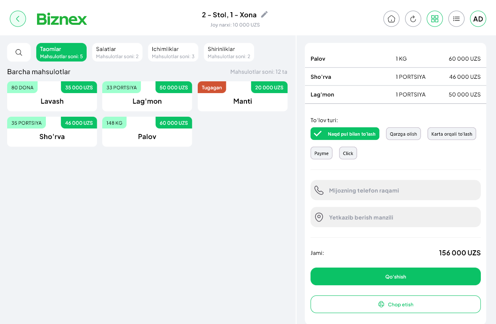

🚀 **Biznex POS dasturidan foydalanishni boshlash juda oddiy!** Quyidagi bosqichlarni bajaring:  

## 1. Kategoriya qo'shish
Avvalo mahsulotlaringizni tartibga solish uchun yangi **kategoriya** yarating.  

#### Nima uchun kategoriya kerak?
1. ✨ **User interfeys qulayligi** — mahsulotlar tartibga tushadi va kassir tezroq topa oladi.  
2. 🖨️ **Printerlarni boshqarish** — har bir kategoriyaga printer biriktiriladi.  
   - 🍲 *Taomlar* kategoriyasidan buyurtma qilinsa, oshxona printeridan chek chiqadi.  
   - 🍹 *Ichimliklar* kategoriyasidan buyurtma qilinsa, bar printeridan chek chiqadi.  

Masalan: *Ichimliklar*, *Taomlar*, *Shirinliklar*. 🎂

## 2. Mahsulot qo'shish
Keyin har bir kategoriya ichiga kerakli **mahsulotlarni qo'shing**.  
Masalan: 🥤 *Pepsi 0.5L*, 🍛 *Osh*, 🍰 *Napoleon torti*.

## 3. Buyurtma yaratish
- **Buyurtmalar** bo'limiga o'ting.  
- ➕ Yangi buyurtma yarating.  
- ✅ Mahsulotlarni tanlang va buyurtmani yakunlang.  

🎉 Shu bilan siz **Biznex POS** yordamida birinchi buyurtmangizni muvaffaqiyatli yaratdingiz!
